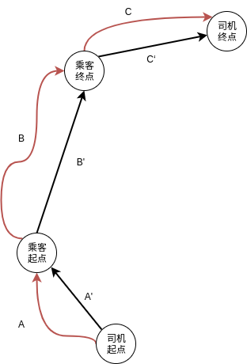

# 实验三  <空间数据的检索> 实验报告

计54 陈宇 2015011343

## 实验任务

给定北京市的路网信息，给定 $N$ 个乘客和 $M$ 个司机的路程信息，可以对某些司机和乘客配对，要求最大化以下表达式：

$$ \sum_{<di, rj> \in Solution}\frac{S_{rj} \rightarrow T_{rj}}{S_{di} \rightarrow S_{rj} + S_{rj} \rightarrow T_{rj} + T_{rj} \rightarrow T_{di}} $$

形式化的讲，就是选择司机和乘客进行配对，使得最后路程共享比之和最大。

另外，实验中要求任意配对的司机和乘客的共享比至少为`0.8`。

**基于路网完成。**

## 实验代码编译运行

```sh
> g++ src/*.cpp -o main -O3 -lmetis
> ./main
```

## 算法

要计算最大的共享比之和，算法主要分为三部分：

### 1. 建索引

由于路网中结点数量太多，所以不可能预处理出任意两点间的最短距离，但是可以将`GTree`先建好，然后储存在文件中，在进行计算的时候直接从文件中载入，由此可以节省大量的时间。

`GTree`的代码是采用的github上TsinghuaDatabaseGroup/GTree项目中的代码，载入和建索引均使用其对应的`read`和`save`函数。

### 2. 计算司机和乘客之间的共享比

运行时，从`driver.txt`和`rider.txt`文件中载入司机和乘客信息，对于任意司机和乘客，都计算其共享比，得出共享比矩阵。

共享比的计算一共分成三部分，如下：

$$A = S_{di} \rightarrow S_{rj}$$
$$B = S_{rj} \rightarrow T_{rj}$$
$$C = T_{rj} \rightarrow T_{di}$$
$$frac = \frac{B}{A+B+C}$$

考虑到`GTree`针对连续多次相同起点的查询有优化，所以在计算司机和乘客之间的共享比时，这三部分是分开计算，并且针对不同部分修改了计算顺序，具体如下：

```c++
for(int j = 0; j < N; j ++)
{
    for(int i = 0; i < N; i ++)
    {
        A[i][j] = search(drivers[j].S, riders[i].S);
    }
}
for(int i = 0; i < N; i ++)
{
    int tmp = search(riders[i].S, riders[i].T);
    for(int j = 0; j < N; j ++)
    {
        B[i][j] = tmp;
    }
}
for(int i = 0; i < N; i ++)
{
    for(int j = 0; j < N; j ++)
    {
        C[i][j] = search(riders[i].T, drivers[j].T);
    }
}
for(int i = 0; i < N; i ++)
    for(int j = 0; j < N; j ++)
    {
        if (B[i][j] >= (A[i][j]+B[i][j]+C[i][j])*threshold)
            dis[i][j] = double(B[i][j])/(A[i][j]+B[i][j]+C[i][j]);
        else dis[i][j] = 0;
    }
```

其中，数组`A`，`B`，`C`数组分别对应上述共享比的三部分，`dis`数组储存共享比。

### 3. 最优化共享比之和

当计算出共享比矩阵之后，余下的问题可以如下描述：**给定权值矩阵，每行每列选且仅选一个数，使得最后所选数字之和最大**。

针对这个问题，可以采用`KM`算法求解，时间复杂度为 $O(n^3)$ ，在不同数据下表现差异很大。

### 优化

在实际测试中发现，有很大一部分时间消耗在了计算共享比矩阵上，随意我在实验中针对计算权值矩阵部分进行了优化，如下：

<div align=center></div>

图片中，红线代表可能的真实路线，黑线表示直线距离。

在实验中，任意配对的乘客和司机均需满足：

$$\frac{B}{A+B+C} \geq 0.8$$

但是 $A,B,C$ 的实际距离计算太慢，为了加快速度，考虑使用直线距离对上面的式子进行预估。

注意到路网数据是基于北京市的实际路况进行采集的，所以可以认为路网数据是不规则的网格图，所以可以做如下假设：

$$B \leq B' * \sqrt{2}$$

这是由于，在网格图中，两点之间的距离都不超过其直线距离的 $\sqrt{2}$ 倍。由此，我们可以先进行如下判断：

$$\frac{B'*\sqrt{2}}{A'+B'+C'} \geq 0.8$$

如果司机和乘客之间不满足上式，则可以近似认为他们之间的实际距离也不满足上述距离。

为了验证上述优化的正确的性和优化比，我在实验中从订单数据中随机抽取 $10000$ 条数据作为乘客，再随机取 $10000$ 条数据作为司机，试验结果如下：

<table align=center>
<thead>
<tr><th rowspan="2">测试点</th><th colspan="2">欧几里得距离</th><th colspan="2">常规路网</th><th colspan="2">优化路网</th><th rowspan="2">权值矩阵加速比(估计)</th></tr>
<tr><td>共享比之和</td><td>运行时间</td><td>共享比之和</td><td>运行时间</td><td>共享比之和</td><td>运行时间</td></tr>
</thead>
<tbody>
<tr>
<td>0</td>
<td>3673.55</td><td>819.791
</td>
<td>2930.47</td><td>1313.01
</td>
<td>2930.47</td><td>929.247
</td>
<td>4.506094</td>
</tr>
<tr>
<td>1</td>
<td>3712.65</td><td>723.615
</td>
<td>2942.83</td><td>1295.32
</td>
<td>2942.83</td><td>851.883
</td>
<td>4.457113</td>
</tr>
<tr>
<td>2</td>
<td>3564.64</td><td>741.896
</td>
<td>2811.07</td><td>1293.62
</td>
<td>2811.07</td><td>847.862
</td>
<td>5.206613</td>
</tr>
<tr>
<td>3</td>
<td>3706.92</td><td>734.506
</td>
<td>2946.55</td><td>1290.23
</td>
<td>2946.55</td><td>849.407
</td>
<td>4.836546</td>
</tr>
<tr>
<td>4</td>
<td>3675.44</td><td>725.922
</td>
<td>2905.74</td><td>1293.27
</td>
<td>2905.74</td><td>853.068
</td>
<td>4.462177</td>
</tr>
<tr>
<td>5</td>
<td>3606.36</td><td>848.291
</td>
<td>2826.55</td><td>1372.93
</td>
<td>2826.55</td><td>915.214
</td>
<td>7.839442</td>
</tr>
<tr>
<td>6</td>
<td>3721.39</td><td>762.56
</td>
<td>2959.63</td><td>1337.11
</td>
<td>2959.63</td><td>873.167
</td>
<td>5.194518</td>
</tr>
</tbody>
</table>

其中，建立权值矩阵的加速比按照如下公式估计：

$$frac = \frac{time_{normal}-time_{euclid}}{time_{quick}-time_{euclid}}$$

可以看出，对于随机数据，上述优化将建立权值矩阵的时间减少非常多，并且最终计算出的权值和并没有受到影响。

对于特殊情况，由于实际路网的复杂性，这个优化可能会导致错误的结果，但是我认为，其思想还是非常有借鉴性的。

## 参考文献

* github, TsinghuaDatabaseGroup/GTree, https://github.com/TsinghuaDatabaseGroup/GTree
* KM, https://wiki-new-meta.icpc-camp.org/KM
* 《算法竞赛入门经典训练指南》, 刘汝佳 陈锋

